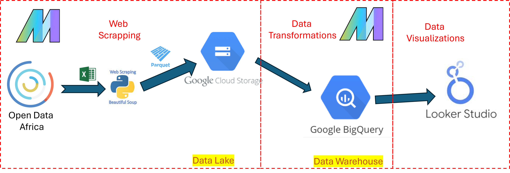
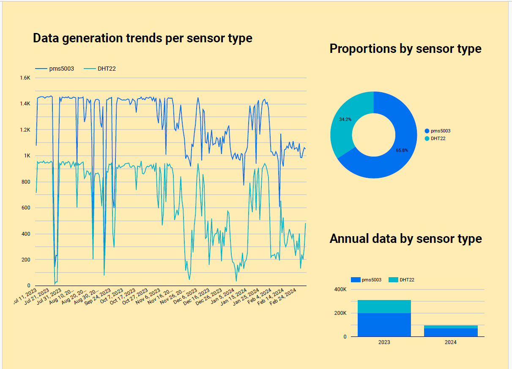

# Introduction

High rate of urbanization, globalization and climate change is leading to decrease in air quality due to increased emissions from industries, motors and machinery, mining and pollutions. Air quality for a given locality can be determine by the concentration of Particulate Matter (PM) measured by air sensors.

# Statement of the problem

Particulate Matter (PM), particles of variable but very small diameter, penetrate the respiratory system via inhalation, causing respiratory and cardiovascular diseases, reproductive and central nervous system dysfunctions, and cancer. On the other hand, nitrogen oxide, sulfur dioxide, Volatile Organic Compounds (VOCs), dioxins, and polycyclic aromatic hydrocarbons (PAHs) are all considered air pollutants that are harmful to humans. Carbon monoxide can even provoke direct poisoning when breathed in at high levels.

Understanding the concentration and distribution in levels and types of air quality across a geographical location provides basis for decision making for habitation and livelyhood; drawing policy interventions scenarios; and identifying data gaps. This project focused on the distribution of air quality across Nairobi County, Kenya.

# Data 

This project utilizes the Sensors Africa data for Kenya provided by the [Open Africa Data](https://open.africa/). This data set contains PM (particulate matter), temperature, and humidity readings taken with low-cost sensors. These sensors measure the concentration of PM in the air, including particles with diameters less than or equal to 1 micrometer (PM1), 2.5 micrometers (PM2.5), and particles with diameters less than or equal to 10 micrometers (PM10). The data set includes information on the sensor type, date, time, and location of the readings, as well as the sensor’s specific measurement values for Temperature (C), Humidity (%), PM1, PM2.5, and PM10. 

## Infrastructure

The following tools and technologies are used:
- Cloud - [**Google Cloud Platform**](https://cloud.google.com)
- Data Ingestion, Orchestration and Transformations- [**Mage**](https://docs.mage.ai/introduction/overview)
- Data Lake - [**Google Cloud Storage**](https://cloud.google.com/storage)
- Data Warehouse - [**BigQuery**](https://cloud.google.com/bigquery)
- Data Visualization - [**Looker Studio**](https://lookerstudio.google.com)


# Architecture


# Data Orchestration and Transformation

The `downloading` block downloads and ingest data (csv files). Enable `monthly-download` trigger for monthly batches.

Run the `data_transformations` block to generate some of the available data transformations.

Running the `to-bigquery` will upload the tranformed data into the biguery platform.

# Dashboard
 
Click on the link below to access the dashboard:

https://lookerstudio.google.com/reporting/052d842e-b4b1-4c3c-8922-b67aa435bb0d




# Steps to Execute the 

- Ensure you have venv installed in your system.
- Configure the Google cloud permissions if you have not already done so and download the key. You can refer to this [guide]() if you do not already know how to do it..

```
git clone git@github.com:lagvier/datatalks_project.git
cd datatalks_project

# create and activate the virtual environment
python venv env
env\Scripts\activate

# install required libraries
pip install -r requirements.txt

```
- Download the Google Cloud key , create CREDS folder within the root directory and put the key in it.

- 

# start mage and access it at http://localhost:6789/
```
mage start mage 
```

